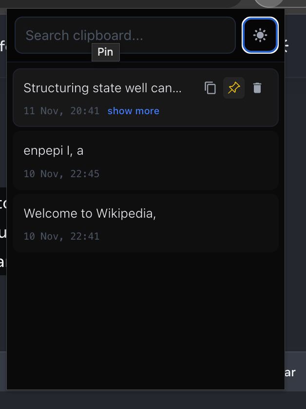
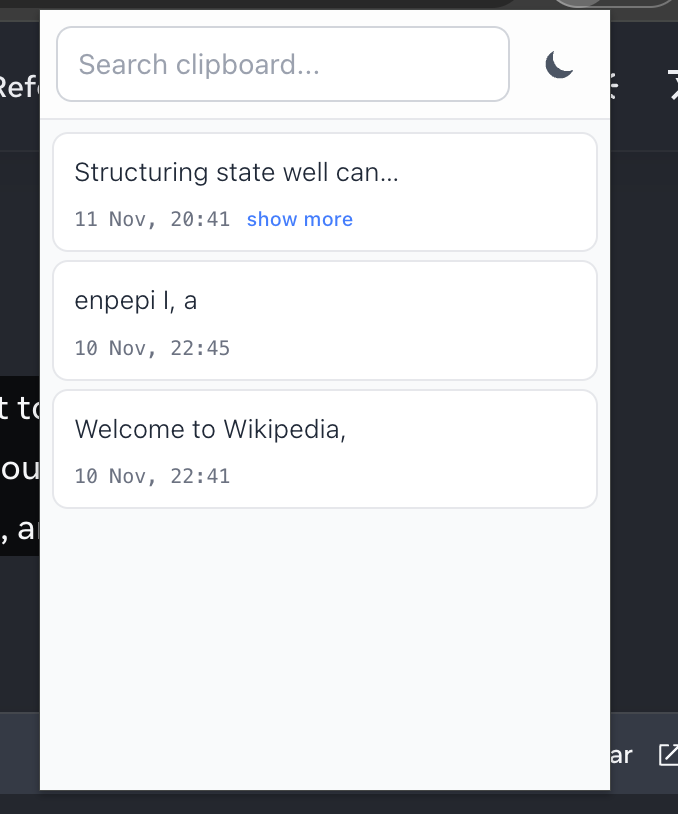

# ClipStack 

A modern, sleek clipboard manager Chrome extension built with React, TypeScript, and Tailwind CSS. Keep track of everything you copy with a beautiful, intuitive interface.

## Screenshots

<div align="center">
  
  
  <p><i>Dark Theme (left) and Light Theme (right)</i></p>
</div>

## Features

- **Automatic Clipboard History** - Automatically captures everything you copy
- **Pin Important Items** - Pin frequently used clips to keep them at the top
- **Smart Search** - Quickly find any copied text with instant search
- **Dark/Light Themes** - Toggle between beautiful dark and light modes
- **Persistent Storage** - All your clipboard history is saved locally

## Installation

### From Source

1. **Clone the repository**
   ```bash
   git clone https://github.com/yourusername/clipstack.git
   cd clipstack
   ```

2. **Install dependencies**
   ```bash
   npm install
   ```

3. **Build the extension**
   ```bash
   npm run build
   ```

4. **Load in Chrome**
   - Open Chrome and navigate to `chrome://extensions/`
   - Enable "Developer mode" (toggle in top right)
   - Click "Load unpacked"
   - Select the `dist` folder from the project

## Development

### Prerequisites

- Node.js 18+ 
- npm or pnpm

### Setup

```bash
# Install dependencies
npm install

# Start development server
npm run dev

# Build for production
npm run build

# Run linter
npm run lint
```

### Project Structure

```
clipstack/
├── src/
│   ├── App.tsx          # Main React component
│   ├── background.ts    # Background service worker
│   ├── content.ts       # Content script for clipboard capture
│   ├── storage.ts       # Chrome storage utilities
│   ├── types.ts         # TypeScript type definitions
│   ├── main.tsx         # React entry point
│   └── index.css        # Global styles
├── public/
│   └── manifest.json    # Chrome extension manifest
├── dist/                # Built extension (generated)
└── vite.config.ts       # Vite configuration
```


## Tech Stack

- **React 19** - UI framework
- **TypeScript** - Type safety
- **Vite 7** - Build tool
- **Tailwind CSS 4** - Styling
- **React Icons** - Icon library
- **Chrome Extension APIs** - Browser integration

## Configuration

The extension stores up to **200 clipboard entries** by default. To change this, modify `STORAGE_LIMIT` in `src/storage.ts`:

```typescript
await setEntries(entries.slice(0, 200)); // Change 200 to your desired limit
```

## Building for Production

```bash
# Build the extension
npm run build

# The built extension will be in the dist/ folder
# You can now:
# 1. Load it as an unpacked extension in Chrome
# 2. Zip the dist folder for distribution
# 3. Submit to Chrome Web Store
```

## Contributing

Contributions are welcome! Please feel free to submit a Pull Request.

## License

This project is licensed under the MIT License - see the [LICENSE](LICENSE) file for details.

## Known Issues

- Content script only captures text from `clipboardData` events (some specialized copy operations may not be captured)
- Background service worker may need reactivation after Chrome suspends it (automatic)

## 🗺️ Roadmap

- [ ] Keyboard shortcuts for quick access
- [ ] Rich text and image support
- [ ] Sync across devices
- [ ] Clip editing capabilities

---

Made with ❤️ by 7sg56
